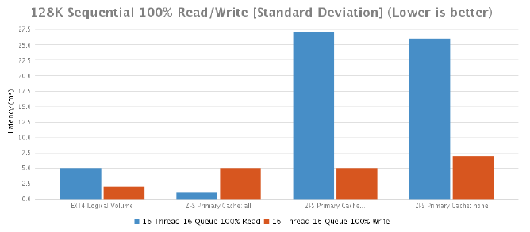

## OpenZFS/Dedupe Put To The Ultimate Test

### Overview

The aim of this task is to re-evaluate the viability of ZFS in our test environment. Concerns were raised over the original test results such as;

1. IO statistics grossly exceed expectations (Could have been influenced by system RAM)
2. Multiple ZFS deadlocks occurring (Possibly due to CPU/RAM contention on the test system)
3. Disk usage savings did not meet or exceed expectations (Possibly due to limiting the amount of user data copied to the machine)

Although the hardware is exactly the same as the previous ZFS test hardware, the results from this round of testing cannot be merged with previous results due to:

1. Changes in drive/raid configuration
2. ZFS record size is set to default (128K)
3. Test server does not have access to the Nimble CS215 SAN

#### Hardware Configuration

The hardware being used for this test is a Dell PowerEdge R720 server with the following hardware configuration:

* 2 x Intel Xeon E5-2667 (3.30GHz, 15MB Cache)
* Intel C600 Chipset
* Memory - 32 GB (4 x 8GB) 1600Mhz DDR3 Registered RDIMMs
* CentOS 7.1 operating system
* PERC H710p Integrated RAID Controller, 1GB NVRAM
* OS storage configuration - 600GB raw storage consisting of 2 x 600GB 15K RPM SAS 6Gbps 2.5in drives in RAID 1
* Data Storage configuration - 1.8TB raw storage consisting of 6 x 600GB 15K RPM SAS 6Gbps 2.5in drives in RAID 10

#### ZFS Benchmark Setup

Because we're using the Dell PERC H710p Integrated RAID Controller, we can't configure ZFS exactly how it prefers to be configured. This would otherwise require JBOD mode, which the H710p card doesn't support. To remedy this, we would need to purchase a PowerVault MD12xx direct attached storage enclosure which includes a PERC H810 RAID Adapter card that does support JBOD mode or (even better) a HBA where ZFS has complete control over the entire world. The more information ZFS has about the disks it's using the better it's able to manage and assess the health of the disks. You can read al about it at [http://open-zfs.org/wiki/Hardware#Hardware_RAID_controllers](http://open-zfs.org/wiki/Hardware#Hardware_RAID_controllers).

We'll also be performing tests with ZFS primarycache set to "all", "metadata" and "none". Just so you are aware, these are the commands you'll need to know in order to change the primarycache setting for the entire pool.

##### Changing the primarycache to "all"

```
$ zfs set primarycache=all zfs
```

##### Create the ZFS pool using /dev/sdb for testing purposes. This will create ~1.62TB storage pool.

```
$ zpool create zfs /dev/sdb
```

##### Create ZFS volume with de-duplication turned on and atime turned off as recommended by some best practices guides.

```
$ zfs create -o de-dup=on -o atime=off zfs/data
```

##### Mount the ZFS volume

```
$ zfs mount zfs/data /data
```

### Test Data

All access to /data is severed to ensure the data contained remained consistent and the tests are not influenced by end users.

There's two types of test data:

1. Compile data
2. User data

#### Compile Data

This is a piece of software to be compiled. To be fair, this could be any piece of software which could be compiled under Linux but the more organisational specific it is, the more relatable it will be to the end users. Since this machine will store software that needs to be compiled anyway, it makes sense to perform a couple of timed compilation tests.

The test data is stored under /data (wherever is convenient) and will be accessed from a remote "helper" server via NFS. More on that later..

#### User Data

This is the reason why we're here. How much of this data can fit into 1.8TB of raw storage. Our users data (known herein as user data) will be migrated via rsync to the test server. How many exactly? enough to fill 100% of the space available. That should be quite a bit... we might not have enough data.

### Testing Process

A total of 3 tests will be performed. All of which are outlined below;

1. Compilation Speed
2. Disk Space Consolidation
3. IO Tests

#### Compilation Speed

This test aims to compare ZFS using an organisational specific metric that everyone is able to understand - software compilation times. The compilation test is executed three times, timed and the resulting run times are then averaged. Flock is used to make sure that compilation times are not influenced by cache.

This test requires the use of a "helper" server. This server should be be unused and ideally connected to the same network switch as the test server. This is to ensure that the testing environment remains consistent throughout the test.

Also since we'll be accessing the data via NFS, it's important set the mount options exactly as they are in production. Failure to do so could impact test results.

##### Mount the test directory via NFS

```
$ sudo mkdir -p /mnt/compile_test && sudo mount -t nfs -o
"vers=3,rsize=8192,wsize=8192,soft" zfs:/data/compile_test
/mnt/compile_test
```

### Testing Procedure

From within the testing directory, execute the following:

```
$ flock /tmp/compile.lock -c "make veryclean && time make -j `grep processor -c /proc/cpuinfo`"
```

#### Results

The results show that there is very little performance difference when using ZFS with in-line deduplication. This is very interesting because the previous compile tests showed a 25% difference which i now believe was due to the fact that we were attempting a CPU intensive workload on the same machine which was running ZFS. For me, it's validation that says we should never use a ZFS server for anything other than ZFS unless it's absolutely necessary.

|  | Run 1 | Run 2 | Run 3 | Average | % Difference |
|---|---|---|---|---|---|
| EXT4 Logical Volume | 366 | 380 | 371 | 372 | +00.00% |
| ZFS Primary Cache: all | 388 | 364 | 370 | 374 | +00.54% |
| ZFS Primary Cache: metadata | 520 | 599 | 568 | 562 | +51.08% |
| ZFS Primary Cache: none | 626 | 654 | 634 | 638 | +71.51% |


### Disk Space Consolidation

Given the original filesystem was ext4 based, obviously, it had 0 disk space consolidation savings. What we're really after is a figure that tells us how much user data we've been able to cram into our ZFS volume.

#### ZFS

Since we only have 1.8TB of raw space and some of that gets eaten up by system overheads, we're left with 1.62TB of available disk space for the ZFS pool. ]The ZFS pool seems to reserve some of this space so the pool can never grow beyond 90% capacity. This leaves us with only 1.46TB of usable disk space.

When deduplication and/or compression is enabled, it's hard to know exactly how much of that 1.46TB you've really used. The command below will tell you but to be honest, if the df command tells you the disk is full, it's damn well full.

##### This commands will tell you how much of your 1.46TB has actually been consumed.

```
$ zpool get allocated zfs
```

#### Results

As was explained earlier, we could only fill the pool to just under 90% capacity. As you can see from the graph below, we managed to squeeze in an impressive 5.19TB of real user data onto the our 1.46TB of available disk space. That's a 71.87% reduction with a deduplication ratio of 3.59x ! At the time of writing (and for comparison purposes) we have 8TB of user data currently spread across two hosts with roughly 300GB saved due to the in-line compression provided by the Nimble SAN.

|  | Disk Usage (GB) | % Difference |
|---|---|---|
| Local (EXT4) | 1565 | +00.00% |
| ZFS w/ de-dupe on | 5190 | -69.85% |


### IO Testing

The basis for this is mostly stolen from [http://www.storagereview.com/synology_rackstation_rs10613xs_review](http://www.storagereview.com/synology_rackstation_rs10613xs_review) and [http://www.storagereview.com/fio_flexible_i_o_tester_synthetic_benchmark](http://www.storagereview.com/fio_flexible_i_o_tester_synthetic_benchmark). The FIO tests are customised slightly for the test environment and were originally contained within one FIO test file. They've since been split into separate test files.

The test names are important because my shitty bash script uses them to pull out the information and populate CSV files to make it easier to copy and paste into this report.

A useful link to help you understand fio stats can be found here: [http://tfindelkind.com/2015/08/24/fio-flexible-io-tester-part8-interpret-and-understand-the-resultoutput/](http://tfindelkind.com/2015/08/24/fio-flexible-io-tester-part8-interpret-and-understand-the-resultoutput/)

Below is the 4K Random 100% write test file.

```
[global]
ioengine=libaio
bs=4k
# This must be set to 0 for ZFS. 1 for all others.
direct=${DIRECT}
# This must be set to none for ZFS. posix for all others.
fallocate=${FALLOCATE}
rw=randrw
# Make sure fio will refill the IO buffers on every submit rather than just
init
refill_buffers
# Setting to zero in an attempt to stop ZFS from skewing results via
de-dupe.
#dedupe_percentage=0
# Setting to zero in an attempt to stop both ZFS and Nimble from skewing
results via compression.
buffer_compress_percentage=0
norandommap
randrepeat=0
rwmixread=70
runtime=60
ramp_time=5
group_reporting
directory=${DIRECTORY}
filename=fio_testfile
time_based=1
runtime=60
[16t-rand-write-16q-4k]
name=4k100writetest-16t-16q
rw=randrw
bs=4k
rwmixread=0
numjobs=16
iodepth=16
```

In order to make use of the file, you'll need fio and libaio-devel installed. There's no rpm for fio so you need to download it and compile yourself.

To execute a ZFS FIO test use the following:

```
$ export DIRECT=0
$ export FALLOCATE=none
$ export DIRECTORY=<zfs_mount>
$ fio <FioTestFile>
```

To execute a non ZFS FIO test (ie EXT4) use the following:

```
export DIRECT=1
export FALLOCATE=posix
export DIRECTORY=<fs_mount>
fio <FioTestFile>
```

#### Results

What do the results say? Well, the default value for primarycache is "all". The results tell you that modifying this value is a bad idea so leave it set to the default value and instead buy enough RAM to store everything in memory. De-duplicated data is considered "metadata" so it will fight for a piece of your cache. In addition to this, you also need space for the actual hash table and whatever else ZFS stores in its cache. A more detailed explanation can be found here: http://open-zfs.org/wiki/Performance_tuning#Deduplication but the basic rule of thumb is more RAM = less problems.

The results also show that in the majority of cases with the ZFS primary cache set to "all" performed better than the EXT4 logical volume. This was expected since the primary cache is using RAM after all.

Below is a detailed breakdown of each of the tests.

### 4K Random 100% Read/Write Test [Throughput]

|  | 16 Thread 16 Queue 100% Read | 16 Thread 16 Queue 100% Write |
|---|---|---|
| EXT4 Logical Volume | 51680 | 6545 |
| ZFS Primary Cache: all | 43770 | 56024 |
| ZFS Primary Cache: metadata | 3386 | 502 |
| ZFS Primary Cache: none | 1552 | 498 |


### 4K Random 100% Read/Write Test [Average Latency]

|  | 16 Thread 16 Queue 100% Read | 16 Thread 16 Queue 100% Write |
|---|---|---|
| EXT4 Logical Volume | 4 | 39 |
| ZFS Primary Cache: all | 5 | 4 |
| ZFS Primary Cache: metadata | 76 | 509 |
| ZFS Primary Cache: none | 165 | 509 |


### 4K Random 100% Read/Write Test [Max Latency]

|  | 16 Thread 16 Queue 100% Read | 16 Thread 16 Queue 100% Write |
|---|---|---|
| EXT4 Logical Volume | 733 | 739 |
| ZFS Primary Cache: all | 287 | 52 |
| ZFS Primary Cache: metadata | 1357 | 1435 |
| ZFS Primary Cache: none | 402 | 3080 |


### 4K Random 100% Read/Write Test [Standard Deviation]

|  | 16 Thread 16 Queue 100% Read | 16 Thread 16 Queue 100% Write |
|---|---|---|
| EXT4 Logical Volume | 10 | 27 |
| ZFS Primary Cache: all | 9 | 5 |
| ZFS Primary Cache: metadata | 36 | 229 |
| ZFS Primary Cache: none | 32 | 349 |


### 8K Sequential 100% Read/Write Test [Throughput]

|  | 16 Thread 16 Queue 100% Read | 16 Thread 16 Queue 100% Write |
|---|---|---|
| EXT4 Logical Volume | 86532 | 106972 |
| ZFS Primary Cache: all | 492187 | 189733 |
| ZFS Primary Cache: metadata | 7496 | 22249 |
| ZFS Primary Cache: none | 6758 | 22798 |


### 8K Sequential 100% Read/Write Test [Average Latency]

|  | 16 Thread 16 Queue 100% Read | 16 Thread 16 Queue 100% Write |
|---|---|---|
| EXT4 Logical Volume | 2 | 2 |
| ZFS Primary Cache: all | 1 | 1 |
| ZFS Primary Cache: metadata | 34 | 12 |
| ZFS Primary Cache: none | 37 | 11 |


### 8K Sequential 100% Read/Write Test [Max Latency]

|  | 16 Thread 16 Queue 100% Read | 16 Thread 16 Queue 100% Write |
|---|---|---|
| EXT4 Logical Volume | 260 | 23 |
| ZFS Primary Cache: all | 742 | 199 |
| ZFS Primary Cache: metadata | 1275 | 425 |
| ZFS Primary Cache: none | 2092 | 459 |


### 8K Sequential 100% Read/Write Test [Standard Deviation]

|  | 16 Thread 16 Queue 100% Read | 16 Thread 16 Queue 100% Write |
|---|---|---|
| EXT4 Logical Volume | 3 | 0 |
| ZFS Primary Cache: all | 3 | 1 |
| ZFS Primary Cache: metadata | 25 | 13 |
| ZFS Primary Cache: none | 41 | 11 |


### 128K Sequential 100% Read/Write Test [Throughput]

|  | 16 Thread 16 Queue 100% Read | 16 Thread 16 Queue 100% Write |
|---|---|---|
| EXT4 Logical Volume | 20830 | 25769 |
| ZFS Primary Cache: all | 287079 | 29784 |
| ZFS Primary Cache: metadata | 4456 | 35186 |
| ZFS Primary Cache: none | 4606 | 32107 |


### 128K Sequential 100% Read/Write Test [Average Latency]

|  | 16 Thread 16 Queue 100% Read | 16 Thread 16 Queue 100% Write |
|---|---|---|
| EXT4 Logical Volume | 12 | 9 |
| ZFS Primary Cache: all | 1 | 8 |
| ZFS Primary Cache: metadata | 57 | 7 |
| ZFS Primary Cache: none | 55 | 7 |


### 128K Sequential 100% Read/Write Test [Max Latency]

|  | 16 Thread 16 Queue 100% Read | 16 Thread 16 Queue 100% Write |
|---|---|---|
| EXT4 Logical Volume | 119 | 40 |
| ZFS Primary Cache: all | 26 | 57 |
| ZFS Primary Cache: metadata | 236 | 86 |
| ZFS Primary Cache: none | 125 | 255 |


### 128K Sequential 100% Read/Write Test [Standard Deviation]

|  | 16 Thread 16 Queue 100% Read | 16 Thread 16 Queue 100% Write |
|---|---|---|
| EXT4 Logical Volume | 5 | 2 |
| ZFS Primary Cache: all | 1 | 5 |
| ZFS Primary Cache: metadata | 27 | 5 |
| ZFS Primary Cache: none | 26 | 7 |




