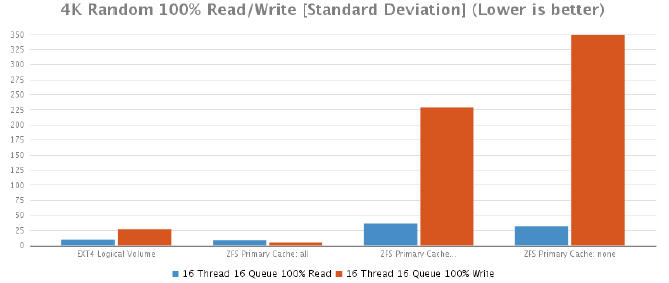

## OpenZFS/Dedupe Put To The Ultimate Test

### Overview

The aim was to evaluate ZFS in a simulated test environment comparing it against local disk storage (ext4), and SAN storage solutions. Comparisons will be made in terms of (but not neccesarily limited to):

1. Performance
2. Storage utilisation
3. Cost
4. Vendor Support

#### End User Analysis

The customer was asked to list the teams that utilise the existing storage solution. From those teams, a random team member was selected for participation in the analysis though their actual involvement was to be kept to a minimum.

After interviewing each team member, it was clear that the storage was being utilised for 3 purposes:

1. Storing User home directories and sharing them via SMB and NFS
2. Interacting with source code checkouts in user home directories for various software products, releases and branches
3. Enabling Continuous Integration(CI) and Continous Delivery (CD) infrastructure to automatically compile and test source code

It was noted that users had a tendency to store their own source code checkouts in their own home directory. With almost 100 software engineers and QA engineers, there was a significant amount of data duplication present in their existing storage solution.

Since one of the main uses for the storage system was software compilation, the customer was asked to develop a compilation test which we could use to test the performance of each storage system. This "compilation test" would be used as an additional data point when evaluating the effectiveness of each solution.

### Testing Process

A total of 3 tests will be performed. All of which are outlined below;

1. Compilation Speed
2. Disk Space Consolidation
3. IO Tests

#### 1. Compilation Speed

The compilation test is executed three times with the resulting run times recorded and then averaged. Team members also requested that compilation tests were performed using flock.

The compilation speed test requires the use of a "helper" server. The helper server should be unused and ideally connected to the same network switch as the test server. By using a helper server, we ensure that the CPU/Memory used for compilation isn't impacting the CPU/Memory being used by the ZFS server.

The helper server isn't necessarily required when comparing compiliation speeds using local SAS storage or SAN storage, but for comparison purposes, these tests will also use the helper server.

NFS mount options are to be kept indentical to those used during production. For reference, this options are:

```
rsize=1048576,wsize=1048576,soft,timeo=600,retrans=2,noresvport,_netdev,nofail

```

#### Hardware Configuration

The hardware being used for this test is a Dell PowerEdge R720 server with the following hardware configuration:

* 2 x Intel Xeon E5-2667 (3.30GHz, 15MB Cache)
* Intel C600 Chipset
* Memory - 32 GB (4 x 8GB) 1600Mhz DDR3 Registered RDIMMs
* CentOS 7.1 operating system
* PERC H710p Integrated RAID Controller, 1GB NVRAM
* OS storage configuration - 600GB raw storage consisting of 2 x 600GB 15K RPM SAS 6Gbps 2.5in drives in RAID 1
* Data Storage configuration - 1.8TB raw storage consisting of 6 x 600GB 15K RPM SAS 6Gbps 2.5in drives in RAID 10

#### ZFS Benchmark Setup

ZFS is optimised to run with storage attached in JBOD mode. However, since a JBOD card was not available, (PERC cards do not support JBOD mode) the data storage area that will be used for testing is configured in raid 10.

In future, a PowerVault MD12xx direct attached storage enclosure which includes a PERC H810 RAID Adapter card that supports JBOD mode would need to be used. The more information ZFS has about the disks it's using the better it's able to manage and assess the health of the disks. You can read all about it at [http://open-zfs.org/wiki/Hardware#Hardware_RAID_controllers](http://open-zfs.org/wiki/Hardware#Hardware_RAID_controllers).

ZFS testing will be repeated with the ZFS primarycache set to "all", "metadata" and "none". These are the commands you'll need to know in order to change the primarycache setting for the entire pool.

##### Changing the primarycache to "all"

```
$ zfs set primarycache=all zfs
```

##### Create the ZFS pool using /dev/sdb for testing purposes. This will create ~1.62TB storage pool.

```
$ zpool create zfs /dev/sdb
```

##### Create ZFS volume with de-duplication turned on and atime turned off as recommended by some best practices guides.

```
$ zfs create -o de-dup=on -o atime=off zfs/data
```

##### Mount the ZFS volume

```
$ zfs mount zfs/data /data
```


##### Mount the test directory via NFS

```
$ sudo mkdir -p /mnt/compile_test && sudo mount -t nfs -o "rsize=1048576,wsize=1048576,soft,timeo=600,retrans=2,noresvport,_netdev,nofail" zfs:/data/compile_test /mnt/compile_test
```

### Testing Procedure

From within the testing directory, the following command was executed. This uses flock and all available CPU's.

```
$ flock /tmp/compile.lock -c "make veryclean && time make -j `grep processor -c /proc/cpuinfo`"
```

#### Results

The results show that there is very little performance difference when using ZFS with in-line deduplication. Previous compilation testing with ZFS running on the same server as the compilation test showed a 25% drop in average compilation times across the various ZFS configurations. The difference highlights the fact that ZFS should not be run a server that is being utilised for other CPU/Memory intensive workloads.

|  | Run 1 | Run 2 | Run 3 | Average | % Difference |
|---|---|---|---|---|---|
| EXT4 Logical Volume | 366 | 380 | 371 | 372 | +00.00% |
| ZFS Primary Cache: all | 388 | 364 | 370 | 374 | +00.54% |
| ZFS Primary Cache: metadata | 520 | 599 | 568 | 562 | +51.08% |
| ZFS Primary Cache: none | 626 | 654 | 634 | 638 | +71.51% |


### Disk Space Consolidation

Given the existing filesystem is ext4 based, obviously, it had 0 disk space consolidation savings. What we're really after is a figure that tells us how much user data we've been able to cram into our ZFS volume.

#### ZFS

Since we only have 1.8TB of raw space and some of that gets eaten up by system overheads, we're left with 1.62TB of available disk space for the ZFS pool. The ZFS pool seems to reserve some of this space so the pool can never grow beyond 90% capacity. This leaves us with only 1.46TB of usable disk space.

When deduplication and/or compression is enabled, it's hard to know exactly how much of that 1.46TB you've really used. The command below will tell you but to be honest, if the df command tells you the disk is full, it's full.

##### This commands will tell you how much of your 1.46TB has actually been consumed.

```
$ zpool get allocated zfs
```

#### Results

As was explained earlier, we could only fill the pool to just under 90% capacity. As you can see from the graph below, we managed to squeeze in an impressive 5.19TB of real user data onto the our 1.46TB of available disk space. That's a 71.87% reduction with a deduplication ratio of 3.59x ! At the time of writing (and for comparison purposes) there is 8TB of user data currently spread across two hosts with roughly 300GB saved due to the in-line compression provided by the Nimble SAN.

|  | Disk Usage (GB) | % Difference |
|---|---|---|
| Local (EXT4) | 1565 | +00.00% |
| ZFS w/ de-dupe on | 5190 | -69.85% |


### IO Testing

The basis for this is mostly stolen from [http://www.storagereview.com/synology_rackstation_rs10613xs_review](http://www.storagereview.com/synology_rackstation_rs10613xs_review) and [http://www.storagereview.com/fio_flexible_i_o_tester_synthetic_benchmark](http://www.storagereview.com/fio_flexible_i_o_tester_synthetic_benchmark). The FIO tests are customised slightly for the test environment and were originally contained within one FIO test file. They've since been split into separate test files.

The test names are important because my shitty bash script uses them to pull out the information and populate CSV files to make it easier to copy and paste into this report.

A useful link to help you understand fio stats can be found here: [http://tfindelkind.com/2015/08/24/fio-flexible-io-tester-part8-interpret-and-understand-the-resultoutput/](http://tfindelkind.com/2015/08/24/fio-flexible-io-tester-part8-interpret-and-understand-the-resultoutput/)

Below is the 4K Random 100% write test file.

```
[global]
ioengine=libaio
bs=4k
# This must be set to 0 for ZFS. 1 for all others.
direct=${DIRECT}
# This must be set to none for ZFS. posix for all others.
fallocate=${FALLOCATE}
rw=randrw
# Make sure fio will refill the IO buffers on every submit rather than just
init
refill_buffers
# Setting to zero in an attempt to stop ZFS from skewing results via
de-dupe.
#dedupe_percentage=0
# Setting to zero in an attempt to stop both ZFS and Nimble from skewing
results via compression.
buffer_compress_percentage=0
norandommap
randrepeat=0
rwmixread=70
runtime=60
ramp_time=5
group_reporting
directory=${DIRECTORY}
filename=fio_testfile
time_based=1
runtime=60
[16t-rand-write-16q-4k]
name=4k100writetest-16t-16q
rw=randrw
bs=4k
rwmixread=0
numjobs=16
iodepth=16
```

In order to make use of the file, you'll need fio and libaio-devel installed. There's no rpm for fio so you need to download it and compile yourself.

To execute a ZFS FIO test use the following:

```
$ export DIRECT=0
$ export FALLOCATE=none
$ export DIRECTORY=<zfs_mount>
$ fio <FioTestFile>
```

To execute a non ZFS FIO test (ie EXT4) use the following:

```
export DIRECT=1
export FALLOCATE=posix
export DIRECTORY=<fs_mount>
fio <FioTestFile>
```

#### Results

What do the results say? Well, the default value for primarycache is "all". The results tell you that modifying this value is a bad idea so leave it set to the default value and instead buy as much RAM as you can to store both ZFS metadata and as much data as you can in RAM so it can be served back to the end users as fast as possible.

De-duplicated data is considered "metadata" so it will fight for a piece of your cache. In addition to this, you also need space for the actual hash table and whatever else ZFS stores in its cache. A more detailed explanation can be found here: http://open-zfs.org/wiki/Performance_tuning#Deduplication but the basic rule of thumb is more RAM = less problems.

The results also show that in the majority of cases with the ZFS primary cache set to "all" performed better than the EXT4 logical volume. This was expected since the primary cache is using RAM.

Below is a detailed breakdown of each of the tests.

### 4K Random 100% Read/Write Test [Throughput]

|  | 16 Thread 16 Queue 100% Read | 16 Thread 16 Queue 100% Write |
|---|---|---|
| EXT4 Logical Volume | 51680 | 6545 |
| ZFS Primary Cache: all | 43770 | 56024 |
| ZFS Primary Cache: metadata | 3386 | 502 |
| ZFS Primary Cache: none | 1552 | 498 |


### 4K Random 100% Read/Write Test [Average Latency]

|  | 16 Thread 16 Queue 100% Read | 16 Thread 16 Queue 100% Write |
|---|---|---|
| EXT4 Logical Volume | 4 | 39 |
| ZFS Primary Cache: all | 5 | 4 |
| ZFS Primary Cache: metadata | 76 | 509 |
| ZFS Primary Cache: none | 165 | 509 |


### 4K Random 100% Read/Write Test [Max Latency]

|  | 16 Thread 16 Queue 100% Read | 16 Thread 16 Queue 100% Write |
|---|---|---|
| EXT4 Logical Volume | 733 | 739 |
| ZFS Primary Cache: all | 287 | 52 |
| ZFS Primary Cache: metadata | 1357 | 1435 |
| ZFS Primary Cache: none | 402 | 3080 |


### 4K Random 100% Read/Write Test [Standard Deviation]

|  | 16 Thread 16 Queue 100% Read | 16 Thread 16 Queue 100% Write |
|---|---|---|
| EXT4 Logical Volume | 10 | 27 |
| ZFS Primary Cache: all | 9 | 5 |
| ZFS Primary Cache: metadata | 36 | 229 |
| ZFS Primary Cache: none | 32 | 349 |



### 8K Sequential 100% Read/Write Test [Throughput]

|  | 16 Thread 16 Queue 100% Read | 16 Thread 16 Queue 100% Write |
|---|---|---|
| EXT4 Logical Volume | 86532 | 106972 |
| ZFS Primary Cache: all | 492187 | 189733 |
| ZFS Primary Cache: metadata | 7496 | 22249 |
| ZFS Primary Cache: none | 6758 | 22798 |


### 8K Sequential 100% Read/Write Test [Average Latency]

|  | 16 Thread 16 Queue 100% Read | 16 Thread 16 Queue 100% Write |
|---|---|---|
| EXT4 Logical Volume | 2 | 2 |
| ZFS Primary Cache: all | 1 | 1 |
| ZFS Primary Cache: metadata | 34 | 12 |
| ZFS Primary Cache: none | 37 | 11 |


### 8K Sequential 100% Read/Write Test [Max Latency]

|  | 16 Thread 16 Queue 100% Read | 16 Thread 16 Queue 100% Write |
|---|---|---|
| EXT4 Logical Volume | 260 | 23 |
| ZFS Primary Cache: all | 742 | 199 |
| ZFS Primary Cache: metadata | 1275 | 425 |
| ZFS Primary Cache: none | 2092 | 459 |


### 8K Sequential 100% Read/Write Test [Standard Deviation]

|  | 16 Thread 16 Queue 100% Read | 16 Thread 16 Queue 100% Write |
|---|---|---|
| EXT4 Logical Volume | 3 | 0 |
| ZFS Primary Cache: all | 3 | 1 |
| ZFS Primary Cache: metadata | 25 | 13 |
| ZFS Primary Cache: none | 41 | 11 |


### 128K Sequential 100% Read/Write Test [Throughput]

|  | 16 Thread 16 Queue 100% Read | 16 Thread 16 Queue 100% Write |
|---|---|---|
| EXT4 Logical Volume | 20830 | 25769 |
| ZFS Primary Cache: all | 287079 | 29784 |
| ZFS Primary Cache: metadata | 4456 | 35186 |
| ZFS Primary Cache: none | 4606 | 32107 |


### 128K Sequential 100% Read/Write Test [Average Latency]

|  | 16 Thread 16 Queue 100% Read | 16 Thread 16 Queue 100% Write |
|---|---|---|
| EXT4 Logical Volume | 12 | 9 |
| ZFS Primary Cache: all | 1 | 8 |
| ZFS Primary Cache: metadata | 57 | 7 |
| ZFS Primary Cache: none | 55 | 7 |


### 128K Sequential 100% Read/Write Test [Max Latency]

|  | 16 Thread 16 Queue 100% Read | 16 Thread 16 Queue 100% Write |
|---|---|---|
| EXT4 Logical Volume | 119 | 40 |
| ZFS Primary Cache: all | 26 | 57 |
| ZFS Primary Cache: metadata | 236 | 86 |
| ZFS Primary Cache: none | 125 | 255 |


### 128K Sequential 100% Read/Write Test [Standard Deviation]

|  | 16 Thread 16 Queue 100% Read | 16 Thread 16 Queue 100% Write |
|---|---|---|
| EXT4 Logical Volume | 5 | 2 |
| ZFS Primary Cache: all | 1 | 5 |
| ZFS Primary Cache: metadata | 27 | 5 |
| ZFS Primary Cache: none | 26 | 7 |


### 8K Random 70% Read 30% Test [Throughput]

|  | 2 Threads<br>2 Queues | 2 Threads<br>4 Queues | 2 Threads<br>8 Queues | 2 Threads<br>16 Queues | 4 Threads<br>2 Queues | 4 Threads<br>4 Queues | 4 Threads<br>8 Queues | 4 Threads<br>16 Queues | 8 Threads<br>2 Queues | 8 Threads<br>4 Queues | 8 Threads<br>8 Queues | 8 Threads<br>16 Queues | 16 Threads<br>2 Queues | 16 Threads<br>4 Queues | 16 Threads<br>8 Queues | 16 Threads<br>16 Queues |
|---|---|---|---|---|---|---|---|---|---|---|---|---|---|---|---|---|
| EXT4 Logical Volume | 4004 | 4504 | 5767 | 6943 | 4328 | 5718 | 6838 | 7658 | 5694 | 6883 | 7719 | 9284 | 6754 | 7675 | 9375 | 9227 |
| ZFS Primary Cache: all | 50117 | 37957 | 45180 | 45199 | 46851 | 56708 | 56576 | 66382 | 38537 | 46762 | 46456 | 40270 | 38447 | 42264 | 40095 | 40322 |
| ZFS Primary Cache: metadata | 4699 | 345 | 355 | 333 | 562 | 528 | 498 | 496 | 833 | 810 | 837 | 779 | 846 | 798 | 723 | 887 |
| ZFS Primary Cache: none | 3943 | 351 | 343 | 345 | 556 | 474 | 456 | 542 | 665 | 695 | 672 | 746 | 916 | 864 | 1009 | 968 |


### 8K Random 70% Read 30% Test [Average Latency]

|  | 2 Threads<br>2 Queues | 2 Threads<br>4 Queues | 2 Threads<br>8 Queues | 2 Threads<br>16 Queues | 4 Threads<br>2 Queues | 4 Threads<br>4 Queues | 4 Threads<br>8 Queues | 4 Threads<br>16 Queues | 8 Threads<br>2 Queues | 8 Threads<br>4 Queues | 8 Threads<br>8 Queues | 8 Threads<br>16 Queues | 16 Threads<br>2 Queues | 16 Threads<br>4 Queues | 16 Threads<br>8 Queues | 16 Threads<br>16 Queues |
|---|---|---|---|---|---|---|---|---|---|---|---|---|---|---|---|---|
| EXT4 Logical Volume         | 0 | 1 | 1 | 3 | 1 | 1 | 3 | 5 | 1 | 3 | 5 | 10 | 3 | 5 | 9 | 23 |
| ZFS Primary Cache: all      | 0 | 0 | 0 | 0 | 0 | 0 | 0 | 0 | 0 | 0 | 1 | 3 | 0 | 1 | 3 | 6 |
| ZFS Primary Cache: metadata | 23 | 45 | 96 | 14 | 31 | 64 | 129 | 19 | 40 | 77 | 165 | 39 | 82 | 179 | 288 |
| ZFS Primary Cache: none     | 23 | 47 | 92 | 15 | 34 | 71 | 118 | 25 | 47 | 95 | 171 | 36 | 35 | 128 | 266 |


### 8K Random 70% Read 30% Test [Max Latency]

|  | 2 Threads<br>2 Queues | 2 Threads<br>4 Queues | 2 Threads<br>8 Queues | 2 Threads<br>16 Queues | 4 Threads<br>2 Queues | 4 Threads<br>4 Queues | 4 Threads<br>8 Queues | 4 Threads<br>16 Queues | 8 Threads<br>2 Queues | 8 Threads<br>4 Queues | 8 Threads<br>8 Queues | 8 Threads<br>16 Queues | 16 Threads<br>2 Queues | 16 Threads<br>4 Queues | 16 Threads<br>8 Queues | 16 Threads<br>16 Queues |
|---|---|---|---|---|---|---|---|---|---|---|---|---|---|---|---|---|
| EXT4 Logical Volume | 95 | 138 | 166 | 299 | 142 | 162 | 326 | 544 | 211 | 230 | 520 | 1333 | 302 | 581 | 888 | 1589 |
| ZFS Primary Cache: all | 808 | 661 | 266 | 204 | 31 | 28 | 86 | 15 | 34 | 38 | 36 | 41 | 30 | 52 | 81 | 64 |
| ZFS Primary Cache: metadata | 914 | 770 | 693 | 963 | 327 | 551 | 865 | 1597 | 472 | 559 | 758 | 947 | 1570 | 2082 | 2458 | 2015 |
| ZFS Primary Cache: none | 1465 | 444 | 927 | 942 | 713 | 1478 | 4246 | 1202 | 1487 | 1523 | 1453 | 1597 | 1352 | 1195 | 1138 | 1346 |


### 8K Random 70% Read 30% Test [Standard Deviation]

|  | 2 Threads<br>2 Queues | 2 Threads<br>4 Queues | 2 Threads<br>8 Queues | 2 Threads<br>16 Queues | 4 Threads<br>2 Queues | 4 Threads<br>4 Queues | 4 Threads<br>8 Queues | 4 Threads<br>16 Queues | 8 Threads<br>2 Queues | 8 Threads<br>4 Queues | 8 Threads<br>8 Queues | 8 Threads<br>16 Queues | 16 Threads<br>2 Queues | 16 Threads<br>4 Queues | 16 Threads<br>8 Queues | 16 Threads<br>16 Queues |
|---|---|---|---|---|---|---|---|---|---|---|---|---|---|---|---|---|
| EXT4 Logical Volume | 1 | 2 | 3 | 7 | 2 | 3 | 7 | 14 | 4 | 7 | 15 | 29 | 7 | 14 | 24 | 39 |
| ZFS Primary Cache: all | 1 | 1 | 0 | 0 | 0 | 0 | 0 | 0 | 0 | 0 | 0 | 0 | 1 | 1 | 2 | 4 |
| ZFS Primary Cache: metadata | 5 | 22 | 27 | 61 | 14 | 29 | 61 | 102 | 20 | 36 | 63 | 101 | 62 | 140 | 274 | 248 |
| ZFS Primary Cache: none | 8 | 17 | 41 | 51 | 21 | 63 | 128 | 68 | 58 | 83 | 145 | 138 | 56 | 45 | 109 | 191 |


### Final Thoughts

All of the solutions below either support inline deduplication/compression or will in the very near future. I've had a couple of them priced just to give people an idea. The Dell pricing is indicative whereas the pricing for the Nimble SAN controller upgrade/All Flash Array were current at the time.

What's below really isn't an apples to apples comparison. The SAN-based solutions include other features such as 4Hr support, predictive analytics, proactive monitoring, easy to use storage management tools, capacity planning and much more which do help to justify the additional expense. An in-house solution will mean in-house support.

With ZFS we still need to be concerned about its RAID configuration but from what i've read so far, it's not as complicated as it is for most servers/SANs (Nimble excluded) but still it's one more thing to learn and understand. While most Systems Administrators would be able to come up with a sensible configuration by themselves, i'm not sure all of them would be able to.Of course, you can ask yourself the question "How often does one need to do that?" and it's safe to say not often. It's still something worth keeping in mind though.

Ultimately, ZFS would be very useful IF used correctly but the risks make it difficult to justify its use for production systems/storage in my opinion. These risks should be mitigated as OpenZFS matures.

### Hardware Recommendations

During testing it was observed that ZFS runs quite a few processes so being able to run them on their own logical core is quite handy to avoid any CPU contension issues. The more CPU's and more cores you can get your hands on, the better.

In terms of RAM, it's a case of if you can add more ram, do it. The more RAM you have, the more data you can cache in it.

If you can stretch the budget a bit more, an SSD drive (one is ok) can be used as a secondary cache. This will help reduce the need to read from the spinning disks directly.

Finally, and this is an absolute MUST HAVE in my opinion. You need a SAS controller card capable of JBOD mode. While we didn't use one in testing (Because we didn't have one), you really should look into it. ZFS has it's own storage management system and it compliments the ZFS filesystem perfectly. Let ZFS manage the RAID and you'll be rewarded.

### Price Comparisons

Below is a price comparison of some of the options we have on the table at the time of writing. All prices are in AUD and are inclusive of GST.

| Option | Price ($AUD Inc GST) |
|---|---|
| Dell PowerVault 1220 DAS (11TB) | $18,157 * |
| Nimble Controller Upgrade (More Storage) | $52,953 |
| Nimble All Flash Array (11TB) | $73,164 |

\* Estimated Price


