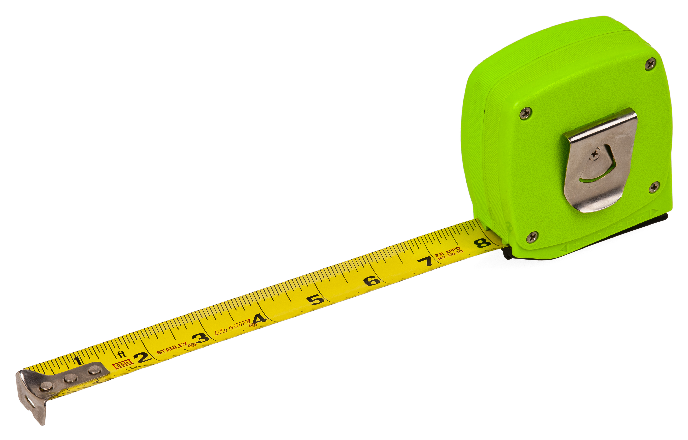
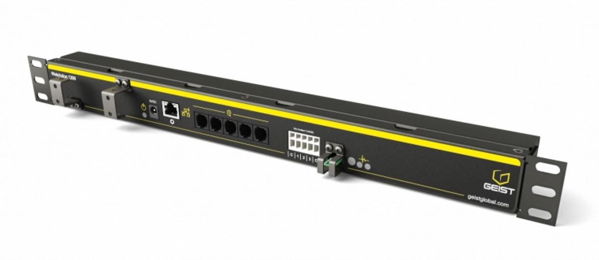
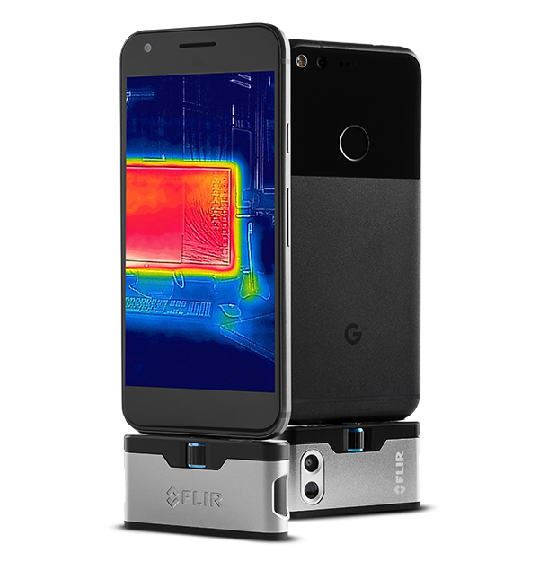

## Air Flow Management (Part 1)

Air flow management in smaller environments has often been a point of contention. Mostly because it's very difficult to realise the benefits in smaller environments or in many cases no one really cares enough to be bothered doing it. As long as servers serve, and potatoes potate everything is peachy 'am i right? Ok maybe not...

### Everything Starts With Measurements

No, not those kinds of measurements! They can be helpful when calculating volume etc, i'm actually referring to taking temperature, humidity, and airflow measurements.

### Temperature/Humidity

Everyone usually has some form of temperature and/or humidity monitoring somewhere. This is either cabled to or inside of a PDU, a UPS or an OOB device and that's enough right? Not for us it isn't!

The first thing you need to determine is where to take the measurements from, and this is going to be different for every site. As a starting point, try to monitor the overall temperature within the room. You'll need a couple of sensors for this because you'll want to take an average across all of them. If you don't, you may find that one area of your server room is hotter than another which is fairly normal to experience. If the average temperature of your room rises quite high then something is definitely wrong with your overall cooling strategy.

If your budget allows, I would also recommend monitoriing the cold air output from your cooling system. If you use a multi-stage approach to cooling, then a significant increase in temperature here will mean that either it's summer time in your server room, or that air conditioning system has failed. Obviously, if you're monitoring the overall temperature of the room, you might also see an increase in average temperature. However, this may take a while before the average is enough to be of concern. This is why I recommend monitoring at least one of the cold air outlets (if you have more than one). Monitoring multiple cold air outlets is useful if you want to check whether cold air is consistent across all outlets but at a minimum one temperature/humidity sensor is recommended.

Finally, you can measure what I consider to be the end of the cold air flow. What I mean by this is If your AC system supply air feeds in via the ceiling, you need to place your sensors at the bottom of the rack. If your supply air feeds in from the floor, you place your sensors at the top of the racks. As cold air flows past the front of servers, it's pulled in. For servers mounted at the top of the rack, this might be an issue as there may not be a whole lot of cold air at the point furthest from the cold air outlet. Monitoring at different points in the rack can help you determine whether there is enough air flow to satisfy all machines in the racks. Having said that, it's not something that I would deem critical for most customers as a simple cheap thermometer or Anemometer could be used to be quick spot check once your servers are installed.

Failure to keep an eye on the temperatures of your infrastructure could see them do a thermal shutdown as a result of a blockage or air conditioning system failure. I've seen it happen before and it's not pretty if it's during business hours or if the infrastructure is critical to your business. 

You could also measure the temperature of air outside of the room. That information could be used to help you determine how you cool the room. If it's colder outside of the room, you might consider opening a few doors or removing a few ceiling tiles etc.

If you're using thermal containment, you may want to do the same in your hot aisle. Personally, i'd just get some cheap mercury based wall thermometers and attach them to the wall. A hot aisle is meant to be hot, so I don't see a need to continuously monitor it especially in a smaller environment.

### Products

#### Temperature/Hunidity etc monitoring - Geist Watchdog 1200 climate monitor

Now that we have figured out what we want to monitor, where the sensors should be placed and how many we need, we should probably look at some products.

There are a couple of companies who specialise in this area but one that i've been quite happy with is Geist. For a small environment, you can't go wrong with the Watchdog 1200 climate monitor. The 1RU Watchdog 1200 has a couple of built in sensors for monitoring temperature, humidity, airflow, ambient light and sound but also supports up to 16 digital sensors, 3 analogue sensors and 4 IP cameras.

Geist seem to have an unending list of sensors to connect to the system. From water sensors and door sensors to isolated voltage sensors and smoke alarms, it'll make you wonder whether the 1200 is actually enough for you.

Finally, you can go online and try out the web interface for free and even navigate a 3D view of the product. Great products and accessories coupled with the ability to test drive the system made choosing Geist easy.

#### Air Flow Meter (Anemometer) - [Jaycar QM1646 Hand-held Anemometer with Separate Sensor](https://www.jaycar.com.au/hand-held-anemometer-with-separate-sensor/p/QM1646)

A handheld anemometer allows you to place the sensor right in the path of the airflow and monitor how much air passes through the fan. Combining this with your temperature readings you can use this information to determine if you've got enough flow across your servers. If you don't have enough flow, you may need more cooling or more/larger ducting.

I prefer anemometers with separate sensors because I don't like having air blasted at my eyeballs while i'm trying to read the display. I can also put the sensor further into the airstream where a all-in-one solution may not even fit.

#### Measuring tape - [Hultafors TALMETER Marking Measure 6m](https://euroworkweardirect.com.au/collections/hultafors-tools/products/hultafors-talmeter-marking-measure-6m?variant=22840653807674)

Hey, sometimes it's useful to have one and this is my favourite. I can measure pipe circumference, inside and outside as well as use it for marking out locations for duct work etc to make it easier for the air conditioning specialists.

#### Thermal Imaging - [FLIR ONE Pro LT Thermal Imaging Camera](https://au.element14.com/flir/flir-one-pro-lt-android-micro-usb/thermal-imager-160-x-120-150mm/dp/2902327)

Thermal imaging is a great way to perform spot checks in your datacentre. Use it to see where your hot or cold spots are and make changes accordingly,

You can also use it to check if circuit breakers are close to overload and check seals around doors, windows and hatches to ensure that cold or warm air isn't going where it's not supposed to.

What's best is that it doesn't have to cost thousands of dollars to do it and it connects to your smartphone and is small and easy to store.... that also makes it easy to lose too I guess.

Still, it's not cheap so it's understandable if it's not in your budget. I've personally found that it comes in handy around the house as well to find hot/cold spots in the house, checking catalytic converters etc.

One thing an FLIR camera cannot do is predict how airflow, temperature etc will change BEFORE you make changes which essentially leads you to making changes, checking with your FLIR camera and repeating until you get it right.

How do we avoid this? With Computational Fluid Dynamics Analysis or CFD Analysis for short. Unfortunately, it's beyond the scope of this article and can cost thousands of dollars to have an expert perform this on your behalf. Instead, I propose that we make the airflow as best we can and for that, In part 2, we'll discuss how plastic, rubber and shower curtains are way more useful than you probably think.

Click [here](articles/air-flow-management-part-2.md) to go to part 2 now!
