## Air Flow Management (Part 2)

Since we now know what changes we want to make and how to measure their effectiveness, in part 2 of this article, we'll cover blanking panels, insulation and thermal containment.

### Blanking Panels

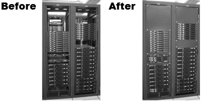

At the front of your server rack, unused rackspace can allow warm air from the rear of the server rack to travel to the front of the server rack raising the inlet teperature of air going into the servers. This obviously results in servers running hotter than they should be and depending on your overall cooling strategy could result in thermal shutdown of your servers. Also, space at the front of the rack will result in some of the cold air being routed around the servers to the rear of the racks instead of through the servers themselves.

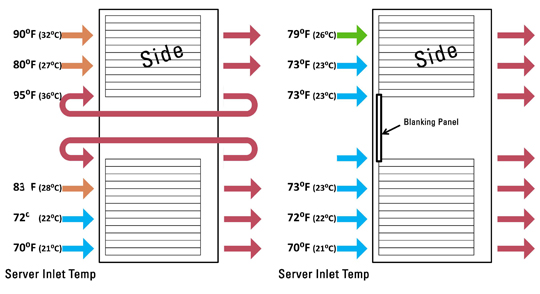

By utilising blanking plates in addition to other airflow management strategies, you'll work towards ensuring that your servers receive the coldest air available to them, and increase the efficiency of cooling solution. By spending a few dollars in the short term, you'll save money in the longer term as you're able to cool more infrastructure with less cooling capacity which not only saves in terms of installation and maintenance costs for your air conditioning systems, it also saves on energy as well as cooling systems may actually be capable of reaching an maintaining your temperature set point.

Having said that, after reviewing blanking plates from manufacturers such as APC, I found two issues with them:

1. High price per RU
2. Made from metal which is thermally conductive

#### [APC AR8136BLK pack of 10 x 1RU blanking panels](https://www.apc.com/shop/au/en/products/1U-19-Black-Modular-Toolless-Airflow-Management-Blanking-Panel-Qty-10/P-AR8136BLK)

The APC AR8136BLK pack of 10 x 1RU blanking panels sells for $109.99 which is around $11 per panel so if I need a 100 or so of them, it quickly becomes expensive and very difficult for a customer to justify the added expense, and to be honest with you, I'm not going to sit there and try to convince someone to buy a specific product because I want to make a sale. The other issue I had with this product was that it was made from metal so warm air from the surrounding area could increase the temperature of the metal which would transfer some of that heat to the front of the rack.

#### [EziBlank 19″ Universal 6RU Modular Blanking Panel](https://www.eziblank.com/product/19-universal-6ru-modular-blanking-panel/)

I was put onto the following company I'm about to mention and since then i almost exclusively recommend plastic blanking panels like those offered by Eziblank. They come in 8 RU sections with the ability to break them apart into a total of 8 individual 1 RU panels. Neither I nor the person would recommended Eziblank are sponsored by the company but their product addressed the two concerns I mentioned above.

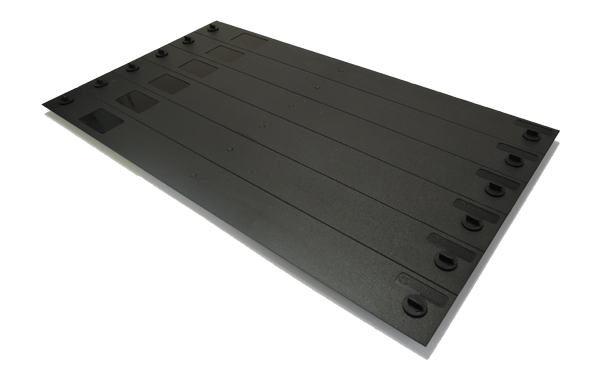

These can be had for around $150 for a box which sounds expensive, but a box contains 10 x 6RU blanking panels covering 60RU worth of space! This works out to be around $2.50 per blanking panel which is going to be a lot easier for a customer to consider trying across a number of racks before they commit to spending any additional money covering any remaining racks.

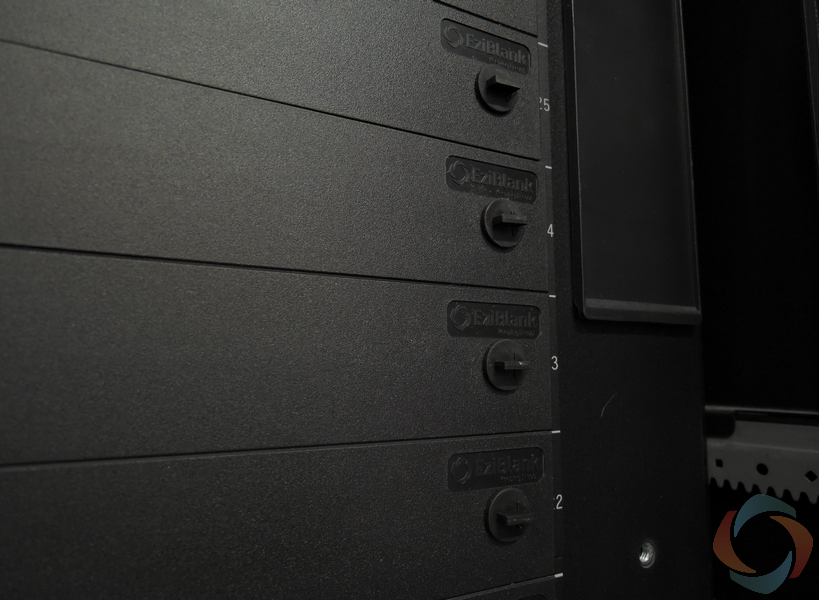

Also, being made of plastic means that they are less thermally conductive than their metal counterparts making it more difficult to transfer heat into the front of the server rack.

Finally, they designed to grab the rail rather than the hole making this usable on round hole racks if you have them as well as square hole or even no hole racks and come in both 19 inch and 24 inch widths.

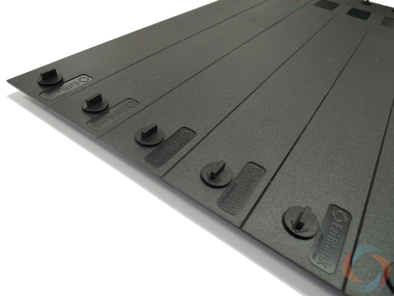

### Insulation

Sometimes when these rooms are built, noise transfer and thermal insulation aren't even topics that are either considered and/or covered. It's usually assumed that because the room is meant to house servers, there should be no need to worry about it but as installers, Systems Administrators, or engineers we do worry about these things.

So what can we do to save us a few dollars on our energy bills? Well to be honest, it's exactly the same as a regular room in your home or office. Everything we look at here and every product we use can be re-used outside of the server room and is probably available from your local home improvement store. If you're lucky, you may be able to use excess materials from elsewhere on the site and cut your costs down to almost zero.

#### Foam Weather Stripping

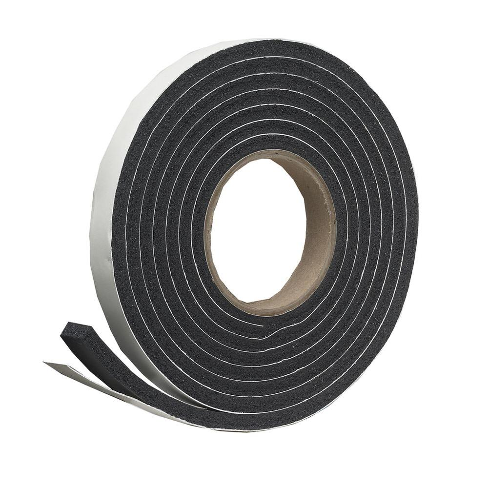
Yep, that's what a roll of tape looks like...

If you have a thermal imaging camera such as the one mentioned in part 1, it's much easier to find gaps around the door frame, windows etc which might be letting cold air out of your server room. To a certain extent, it could also be letting out noise too. If you don't have a thermal imaging camera, you can use your hands/face to feel for cooler than normal air escaping from the room. Your ears might also give you a warning if things are louder in one part of the room than another.

If you find anything such as a door gap, you can seal between the door and the door frame to see if that reduces the noise/leakage. Foam weather stripping come in a variety of different widths and lengths so there's bound to be something that you can use.

#### Wall/Floor/Ceiling insulation

##### Bat vs Blown vs Foam

It sounds like an alternate version of scissor, paper, rock doesn't it?

No we're actually talking about insulation inside your walls, floor and ceiling. You could be wondering how this even relates to airflow management? Well, without this stuff, you're allowing cold air from inside the room to potentially be lost to the outside world and no one wants that because this means that your cooling solution isn't operating as efficiently as it could be.

This is a problem that definitely should be looked at when building your room because it's easier (and cheaper) to do when walls have been framed but not sheeted. Retrofitting this once the drywall is on is usually going to be prohibitively expensive and the costs outweight the benefits.

Please note however, that if you have a drop ceiling or a raised floor (or both) then you may not need to worry as much since they do an OK job by themselves.

##### Spray Foam Insulation

Below you can see a specialist using spray foam insulation to insulate between the wall studs:

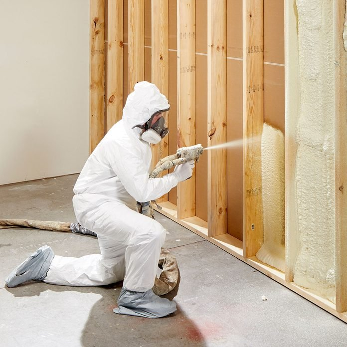

As you can see it uses foam insulation that's sprayed between the wall studs creating a thermal barrier. This solution is the most efficient of the 3 solutions but comes at a higher cost when compared with the other two methods.

##### Batt insulation

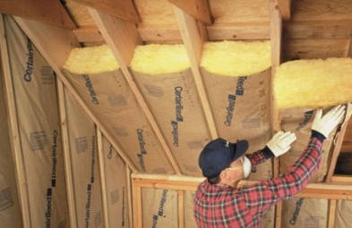

There are other options such as Batt insulation which can be installed and is generally cheaper and works pretty well although not quite as well as spray foam. To be honest, the benefits of spray foam may be neglible when compared to its cost but it's something I haven't been able to test.

##### Blown insulation

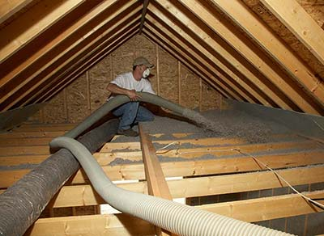

This is only really an option for the ceiling and I don't recommend it. This stuff could fall through a ceiling and block server innlets, and it makes it an absolute pain to route cables through it. Don't consider using this at all.

### Thermal Containment

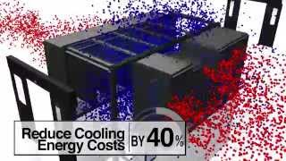

Modern servers draw cold air in from the front, use barriers/ducts to direct the airflow over the components that need to be cooled and exhaust the hot air out the rear. By doing so, the servers make efficient use of the airflow available.

<iframe width="320" height="266" src="https://www.youtube.com/embed/rTFISveqaPo" title="YouTube video player" frameborder="0" allow="accelerometer; autoplay; clipboard-write; encrypted-media; gyroscope; picture-in-picture" allowfullscreen></iframe>

You might be thinking "why don't we do this in our server room?". Well, time and cost are normally a factor but it might also be difficult to sell it to management if you already have a server room that "just works". So if it's difficult to sell the idea of thermal containment, you might be able to slap together a proof of concept for relatively little cost (sometimes free) that will hopefully drive the point home.

#### Thermal Containment - Proof of Concept

Your going to need some paint sheets or a few shower curtains etc whichever one is cheaper and easier to get your hands on. You'll also need a roll of duct tape, something to cut the tape into strips, a ladder and probably a couple of hours to spare.

At the front of your server racks, you'll need to fill in the gap above them. Use the heavier sheets here. They generally won't have to cover as much area so weight shouldn't be an issue. Tape the sheets to the ceiling and let em hang. Use tape every metre or so and overlap with extra pieces of tape as necessary to make sure the sheets stay there.

For larger areas like  thoroughfares, you will need a lighter sheet like a shower curtain or perhaps a door curtain which is typically used on building sites so dust doesn't go where it's not supposed to.

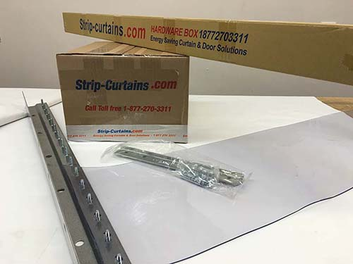

Once your done, you can let the room equalise under its existing AC settings before taking some measurements and giving your stakeholders a walkthrough. Personally, I've gone so far as to turn AC unit off completely to demonstrate how well it can work. Don't do this unless you know your IT loads REALLY well or just completely insane.

### DIY Thermal Containment

If you've managed to sell your proof of concept, now it's time to get real and luckily, I have a plan for that too.

You'll need angle brackets, self tapping screws and rolls of clear PVC anti static sheet. If you want to take your install to the next level and make it adjustable and removal, add to your list threaded pot magnets, stainless steel washers and wing nut bolts.

Start by cutting your PVC sheet to the shape you need to fill the space. Pre drill and screw the clear PVC sheet to one half of the angle brackets. Screw the brackets into the ceiling and you're done.

If you're trying to take your install to the next level, instead of screwing the brackets to the ceiling, bolt the angle brackets to the threaded pot magnets using a wing nut bolt and washers on both sides of the PVC sheet. Finally attach the entire contraption to the ceiling via the pot magnets.

What? You were expecting more? Make sure you don't cut your sheet too short. A little overhang is better than not enough. You can also heat it with a heat gun to bend it into certain shapes.

### Final Thoughts

Remember that you need to be taking measurements both before and AFTER because otherwise you won't know if the changes you're making ACTUALLY WORK. Don't simply take my word for it.. take measurements and take action accordingly.
