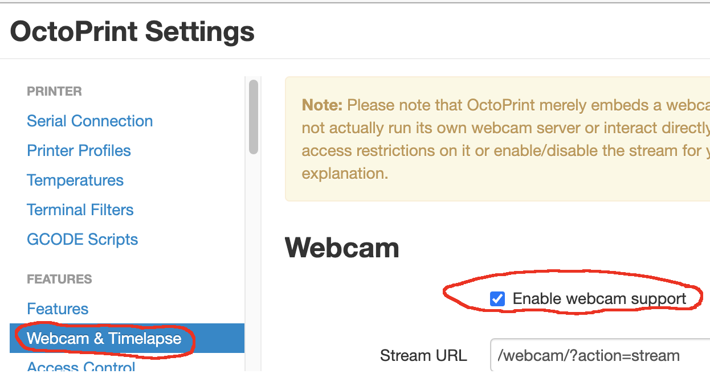
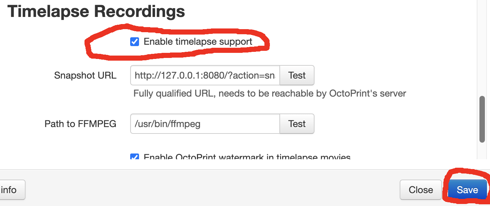

## Installing OctoPrint on Ubuntu 16.04.

Recently there's been a shortage of Raspberry Pi boards on the market which has made some of us look for alternatives.

Unfortunately, most of the alternatives run older versions of Ubuntu or Debian which aren't compatible with most recent versions of OctoPrint which requires Python 3.6 as a minimum.

This guide will go through configuring OctoPrint under Ubuntu 16.04. Specifically the flavour released by Orange Pi which i'm using with the Orange Pi Zero R1 but it should be fairly similar for other Single Board Computers (SBC's).

Please note however that this isn't an endorsement for the Orange Pi Zero R1. The reason i'm using it is because it was the only SBC I had lying around. As a general rule however, you should use an SBC with at least 2 CPU cores, and 1GB of RAM.

Finally, if you're using another board which has a different default username other than orangepi, you'll need to modify any of the commands which mention orangepi and replace it with your username whether that be pi, bananapi, ubuntu etc.

### Items Needed

1. A single board computer such as the Orange Pi Zero or Banana Pi Zero etc.
2. Access to the SBC via its default SSH credentials

### (Optional but highly recommended) Create a dedicated pi user

I run a couple of 3D printers via OctoPrint and most use a Raspberry Pi 4 or a Raspberry Pi Zero W depending on whether they're running webcams or not. I personally like that all of my installations look and feel the same way as that'll make it easier to make changes to them.

I usually start by creating a dedicated pi user similar to that used by Raspberry Pi OS. Since this is an optional step, you can skip this part but if you do wish to proceed with this, you'll need to modify any commands or steps that mention orangepi as the user and instead use pi as your user.

#### Create the user account

Use the command below to create the new user. You can also omit the "`--disable-password`" flag and the adduser command will ask you to set a password. I personally use SSH key based authentication so never have a need to set a password.

```
orangepi@orangepir1:~$ sudo adduser --home /home/pi --shell /bin/bash --disabled-password pi
Adding user `pi' ...
Adding new group `pi' (1001) ...
Adding new user `pi' (1001) with group `pi' ...
Creating home directory `/home/pi' ...
Copying files from `/etc/skel' ...
Changing the user information for pi
Enter the new value, or press ENTER for the default
	Full Name []: 
	Room Number []: 
	Work Phone []: 
	Home Phone []: 
	Other []: 
Is the information correct? [Y/n] Y
orangepi@orangepir1:~$ 
``` 

#### Allow Sudo access

This is somewhat controversial but I usually give the pi user access to execute commands as the root user via sudo and I provide that user with the ability to run any command without the need to enter a password. The reality is that I'm only usually this to run OctoPrint and I never need to use the root account. I also have some accountability since sudo commands are logged in /var/log/auth.log. It's good practice to NEVER use the root user account and the sooner you begin to reduce your reliance on the root user, the better off you'll be in the long run.

```
orangepi@orangepir1:~$ cat | sudo tee /etc/sudoers.d/pi <<EOF
pi ALL=(ALL) NOPASSWD: ALL
EOF

orangepi@orangepir1:~$
```

Now you can change to your new user and begin the installation as the pi user.

```
orangepi@orangepir1:~$ sudo su - pi
pi@orangepir1:~$ 
```

### Installing Python 3.6

Firstly, verify the version of Python 3 that's installed on your SBC

```
orangepi@orangepir1:~$ python3 -V
Python 3.5.2
```

In my case it was 3.5.2 and this is the only version that's available for my distro.

```
orangepi@orangepir1:~$ sudo apt-get update && sudo apt-cache policy python3
python3:
  Installed: 3.5.1-3
  Candidate: 3.5.1-3
  Version table:
 *** 3.5.1-3 500
...
```

Unfortunately, installing Python3.6 has become quite difficult in 2022 when this article has been written since many of the repositories have been taken down. Instead, we're goiing to compile it from source making sure not to replace the system python since doing so would break a lot of things.

#### Install the required packages

The commands below install the required packages which are necessary to compile Python 3.6 from source.

```
orangepi@orangepir1:~$ sudo apt-get update
orangepi@orangepir1:~$ sudo apt-get install -y build-essential checkinstall
orangepi@orangepir1:~$ sudo apt-get install -y libreadline-gplv2-dev libncursesw5-dev libssl-dev libsqlite3-dev tk-dev libgdbm-dev libc6-dev libbz2-dev libffi-dev zlib1g-dev
```

#### Download Python 3.6 from python.org

I used 3.6.10. Why 3.6.10 and not something newer? Not sure... i just picked a minor version at random. You can use newer versions of Python 3.6 such as 3.6.15 if you like. The process is still the same and only the version numbers will change.

```
orangepi@orangepir1:~$ curl -o python.tgz https://www.python.org/ftp/python/3.6.10/Python-3.6.10.tgz
```

#### Decompress the archive

```
orangepi@orangepir1:~$ sudo tar xzf python.tgz
```

#### Compile and install Python 3.6

```
orangepi@orangepir1:~$ cd python-3.6.10
orangepi@orangepir1:~$ sudo ./configure --enable-optimizations
orangepi@orangepir1:~$ sudo make altinstall
```

#### Check that Python 3.6 is installed correctly

```
orangepi@orangepir1:~$ /usr/local/bin/python3.6 -V
Python 3.6.10
```

### Install OctoPrint

#### Install supporting packages

It is recommended to run OctoPrint in a Python virtual environment and this will make sure we don't break or modify our newly installed version of Python 3.6 so we need to install the virtual environment Python module.

```
orangepi@orangepir1:~$ sudo /usr/local/bin/python3.6 -m pip install virtualenv
```

#### Create the Python virtual environment named OctoPrint using Python 3.6.

```
orangepi@orangepir1:~$ /usr/local/bin/python3.6 -m venv OctoPrint
```

#### Install OctoPrint

```
orangepi@orangepir1:~$ source OctoPrint/bin/activate
orangepi@orangepir1:~$ pip install OctoPrint
```

#### Install the OctoPrint systemd service file

By default there's no real way to manage starting and stopping OctoPrint. I've created a systemd service file which will be used instead.

```
orangepi@orangepir1:~$ cat | sudo tee /etc/systemd/system/octoprint.service <<EOF
[Unit]
Description=OctoPrint
After=network-online.target
Wants=network-online.target
[Service]
EnvironmentFile=/etc/default/octoprint
Type=simple
Restart=always
User=orangepi
ExecStart=/home/orangepi/OctoPrint/bin/octoprint serve
[Install]
WantedBy=multi-user.target
EOF
```

Note that depending on the user that runs OctoPrint, you may have to edit the above-mentioned file and change the user as well as the ExecStart path to the octoprint script. If you're using an Orange Pi, the username should be orangepi and if you've been following this tutorial so far, the path should be /home/orangepi/OctoPrint/bin/octoprint.

### Create the Environment file

The environment file is useful for configuring system variables that need to be configured before the service is started.

During testing I found that OctoPrint would refuse to start without a correctly configured locale. To fix this create the environment file with the following configuration:

```
orangepi@orangepir1:~$ cat | sudo tee /etc/default/octoprint <<EOF
# Setting these because OctoPrint fails to start without a correctly configured locale
LC_ALL=C.UTF-8
LANG=C.UTF-8
EOF

```

#### Configure systemd and start OctoPrint!

```
orangepi@orangepir1:~$ sudo systemctl daemon-reload
orangepi@orangepir1:~$ sudo systemctl enable octoprint
orangepi@orangepir1:~$ sudo systemctl start octoprint
```

#### Check if OctoPrint is running

You should see something similar to the following if OctoPrint is running and can now access it via http://IP\_ADDRESS:5000/

```
orangepi@orangepir1:~$ sudo systemctl status octoprint
● octoprint.service - OctoPrint
   Loaded: loaded (/etc/systemd/system/octoprint.service; enabled; vendor preset: enabled)
   Active: active (running) since Mon 2022-09-26 09:32:27 UTC; 27s ago
 Main PID: 3327 (octoprint)
   CGroup: /system.slice/octoprint.service
           └─3327 /home/pi/OctoPrint/bin/python3.6 /home/pi/OctoPrint/bin/octoprint serve
...
```

If the status isn't "Active: active (running)", your best bet is to check the systemd journal and scroll to the bottom of the output as the output is paginated. You can also use the systemctl command as well, but I find that the journalctl has more useful output.

```
orangepi@orangepir1:~$ sudo journalctl -u octoprint
orangepi@orangepir1:~$ sudo systemctl status octoprint
```

With OctoPrint running you can really just stop here and access the web interface and be done with it if you want. OctoPrint will start when the SBC boots.

### Enabling Webcam support

You don't have to install and configure webcam support but I recommend that you do in case you ever change your mind and decide to connect a webcam in future.

#### Install required packages

The webcamd service will handle serving our webcam up for OctoPrint and the v4l-utils allows us to use the v4l2-ctl command which can help us adjust the webcam settings for our environment if the default settings are not adequate.

```
orangepi@orangepir1:~$ sudo apt-get update && sudo apt-get install -y webcamd v4l-utils
```

#### Configure the webcamd service

You may want to edit this file after creation and update the USER if the user that we need to run webcamd (should be the same user as the one running OctoPrint is not orangepi.

```
orangepi@orangepir1:~$ cat | sudo tee /etc/default/webcamd <<EOF
# Configuration for /etc/init.d/webcamd

# Daemon
DAEMON=/usr/bin/webcamd

# Log file to use
LOG=/var/log/webcamd.log

# User to run under
USER=orangepi

# Should we run at startup?
ENABLED=1
EOF

```

#### Start the webcamd service

```
orangepi@orangepir1:~$ sudo systemctl enable webcamd
orangepi@orangepir1:~$ sudo systemctl start webcamd
```

#### Check if webcamd is running

You should see something similar if it is running:

```
orangepi@orangepir1:~$ sudo systemctl status webcamd
● webcamd.service - the OctoPi webcam daemon with the user specified config
   Loaded: loaded (/etc/systemd/system/webcamd.service; enabled; vendor preset: enabled)
   Active: active (running) since Wed 2022-09-21 14:44:20 BST; 5 days ago
  Process: 9258 ExecStart=/root/bin/webcamd (code=exited, status=0/SUCCESS)
 Main PID: 9282 (mjpg_streamer)
    Tasks: 3 (limit: 4915)
   Memory: 1.6M
   CGroup: /system.slice/webcamd.service
           └─9282 ./mjpg_streamer -o output_http.so -w ./www  -i input_uvc.so -r 1280x720 -f 30 -d /dev/vi
...
```

If the status isn't "Active: active (running)", your best bet is to check the systemd journal and scroll to the bottom of the output as the output is paginated. You can also use the systemctl command as well, but I find that the journalctl has more useful output.

```
orangepi@orangepir1:~$ sudo journalctl -u webcamd
orangepi@orangepir1:~$ sudo systemctl status webcamd
```

The service will fail to start if no webcam is connected to your device. If the webcam doesn't appear in OctoPrint, you'll need to restart the webcamd service using the command below or  restart the SBC if you don't have access to the console via SSH.

#### Enable Webcam support in OctoPrint

Log into the OctoPrint Web interface and click on the wrench icon in the top right corner to open the OctoPrint server settings.


Under Features, choose Webcam and Timelapse.

Under Webcam, choose Enable webcam support.


(Optional) Under Timelapse Recordings, choose Enable timelapse support.


Choose Save.


### Making OctoPrint accessible via HTTP or HTTPS

I tend to forget which port to use to access OctoPrint which is why I use haproxy as a HTTP/HTTPS proxy. This means that I only have to remember the IP address and use http://IP\_ADDRESS/ instead.

#### Install haproxy

We'll also install ssl-cert to provide HTTPS connectivity.

```
orangepi@orangepir1:~$ sudo apt-get update && sudo apt-get install -y haproxy ssl-cert
```

#### Configure haproxy.cfg

```
orangepi@orangepir1:~$ cat | sudo tee -a /etc/haproxy/haproxy.cfg <<EOF

# OctoPrint specific configuration

frontend public
        bind :::80 v4v6
        bind :::443 v4v6 ssl crt /etc/ssl/snakeoil.pem
        option forwardfor except 127.0.0.1
        use_backend webcam if { path_beg /webcam/ }
        default_backend octoprint

backend octoprint
        acl needs_scheme req.hdr_cnt(X-Scheme) eq 0

        reqrep ^([^\ :]*)\ /(.*) \1\ /\2
        reqadd X-Scheme:\ https if needs_scheme { ssl_fc }
        reqadd X-Scheme:\ http if needs_scheme !{ ssl_fc }
        option forwardfor
        server octoprint1 127.0.0.1:5000
        errorfile 503 /etc/haproxy/errors/503-no-octoprint.http

backend webcam
        reqrep ^([^\ :]*)\ /webcam/(.*)     \1\ /\2
        server webcam1  127.0.0.1:8080
        errorfile 503 /etc/haproxy/errors/503-no-webcam.http
EOF
```

#### Install the HTTP 503 error files

Without these error files, the service won't start but essentially, the contents are displayed when the backend service ie OctoPrint isn't running.

Currently they're stored in my GitHub but as soon as I find who maintains them, i'll update the documentation.

```
orangepi@orangepir1:~$ sudo curl -o /etc/haproxy/errors/503-no-webcam.http haproxy-errors-503-no-webcam.http
orangepi@orangepir1:~$ sudo curl -o /etc/haproxy/errors/503-no-octoprint.http haproxy-errors-503-no-octoprint.http
```

#### Generate the self-signed SSL certificate

Yes, we're using a self-signed certificate. Using anything else is beyond the scope of this article.

```
orangepi@orangepir1:~$ sudo make-ssl-cert generate-default-snakeoil
```

#### Combine the certificate and private key into /etc/ssl/snakeoil.pem

For HTTPS, we need to combine the SSL certificate file with the private key file in .pem format and store the contents in /etc/ssl/snakeoil.pem. Without this, haproxy will fail to start.

```
orangepi@orangepir1:~$ sudo cat /etc/ssl/certs/ssl-cert-snakeoil.pem | sudo tee /etc/ssl/snakeoil.pem
orangepi@orangepir1:~$ sudo cat /etc/ssl/private/ssl-cert-snakeoil.key | sudo tee -a /etc/ssl/snakeoil.pem
```

#### Start the haproxy service

```
orangepi@orangepir1:~$ sudo systemctl enable haproxy
orangepi@orangepir1:~$ sudo systemctl start haproxy
```

#### Check if haproxy is running

You should see something similar if haproxy is running and can now access it via http://IP\_ADDRESS/ or https://IP\_ADDRESS/

```
orangepi@orangepir1:~$ sudo systemctl status haproxy
● haproxy.service - HAProxy Load Balancer
   Loaded: loaded (/lib/systemd/system/haproxy.service; enabled; vendor preset: enabled)
   Active: active (running) since Sun 2022-09-25 14:12:43 UTC; 20h ago
     Docs: man:haproxy(1)
           file:/usr/share/doc/haproxy/configuration.txt.gz
 Main PID: 726 (haproxy-systemd)
   CGroup: /system.slice/haproxy.service
           ├─726 /usr/sbin/haproxy-systemd-wrapper -f /etc/haproxy/haproxy.cfg -p /run/haproxy.pid
           ├─728 /usr/sbin/haproxy -f /etc/haproxy/haproxy.cfg -p /run/haproxy.pid -Ds
           └─729 /usr/sbin/haproxy -f /etc/haproxy/haproxy.cfg -p /run/haproxy.pid -Ds
...
```

If the status isn't "Active: active (running)", your best bet is to check the systemd journal and scroll to the bottom of the output as the output is paginated. You can also use the systemctl command as well, but I find that the journalctl has more useful output.

```
orangepi@orangepir1:~$ sudo journalctl -u haproxy
orangepi@orangepir1:~$ sudo systemctl status haproxy
```

You can also find more information in the /var/log/haproxy.log file if you're still not getting enough information to tell you why the service isn't starting.

```
orangepi@orangepir1:~$ sudo cat /var/log/haproxy.log
```
